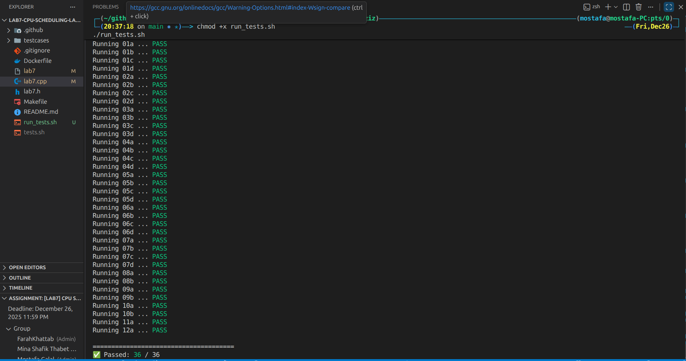

# CPU Scheduling Algorithms Simulator

## Description

This project implements a CPU scheduling simulator in C++ that analyzes and visualizes various process scheduling policies used in operating systems. The program takes a set of processes with their arrival times and service times (or priorities) and simulates their execution order based on selected algorithms. It provides two modes of output: a timeline trace visualization and a statistical summary .

## Implemented Algorithms

The following scheduling policies are supported :

1. **FCFS** (First Come First Serve)
2. **RR** (Round Robin) - requires quantum parameter
3. **SPN** (Shortest Process Next)
4. **SRT** (Shortest Remaining Time)
5. **HRRN** (Highest Response Ratio Next)
6. **FB-1** (Feedback with constant quantum )
7. **FB-2i** (Feedback with exponential quantum )
8. **Aging** - Xinu OS aging scheduler

## File Structure

* `lab7.cpp` / `lab7.h`: Source code files containing the scheduling logic and data structures.
* 
`Makefile`: Compilation script to build the `lab7` executable.


* 
`Dockerfile`: Configuration for building a lightweight Docker image of the application.


* `README.md`: This documentation file.

## How to Build and Run

### Using Make (Local Environment)

To compile the program, navigate to the project directory and run:

```bash
make all

```

This generates an executable named `lab7`.

### Running the Simulator

The program accepts input via standard input (`stdin`). You can run it by redirecting an input file or piping data :

```bash
# Using input redirection
./lab7 < 01a-input.txt

# Using pipe
cat 01a-input.txt | ./lab7

```

### Input Format

The input file must follow this structure :

1. **Mode**: `trace` (visualization) or `stats` (metrics table).
2. **Policies**: Comma-separated list of policy IDs (e.g., `2-4` for RR with q=4).
3. **Simulation Limit**: Integer for the simulation time limit.
4. **Process Count**: Total number of processes.
5. **Process Details**: One line per process.
* Format for policies 1-7: `Name, ArrivalTime, ServiceTime`
* Format for Aging (8): `Name, ArrivalTime, Priority`


### Docker Usage

To build and run the project using Docker:

1. **Build the image:**
```bash
docker build -t cpu-scheduler .

```


2. **Run the container:**
```bash
docker run -i --rm cpu-scheduler < 01a-input.txt

```


## Output

* 
**Trace Mode**: Displays a time-chart where `*` indicates a running process and `.` indicates a waiting process .


* 
**Stats Mode**: Outputs a table showing Finish Time, Turnaround Time, and Normalized Turnaround Time for each process.


## Testing

You can verify the output against the provided test cases using `diff`:

```bash
./lab7 < 01a-input.txt | diff - 01a-output.txt

```

If no output is produced, the test passed successfully .


image link : [click on me](https://hub.docker.com/layers/mostafaabdelazziz/lab7/1.0/images/sha256-1e01c389139b92df7a67ba564c7fa597e5a91f3bf20e63e0cd1e24b6f36f46e2)